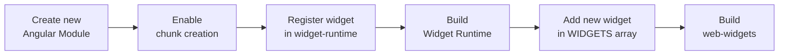

# WebWidgets

This project contains the widgets that are created by Impartner Inc., to use inside PRM.
This project was generated with [Angular CLI](https://github.com/angular/angular-cli) version 7.3.1.

## Development server

## Build

Run `package` task to build the project. The build artifacts will be stored in the `dist/package` directory. Run `package-dev` task to get a development version.

## Development Mode

Run `package-dev` task, and after that, run `start-demo` task.

## Running unit tests

Run `test` task to execute the unit tests via [Karma](https://karma-runner.github.io).

## Create new widgets

The process to create widgets is the following>



**1. Create new Angular Module**

- Create the module inside `src/app/widgets` path.
- Be sure that inside the module folder have at least one `container` folder, where you can find the main component of the module. We are following the same practices we alredy had in PRM (Smart Components).
- Choose SCSS as preprocesor for the module.
- Be sure to create at least two components: one for _View_ (or render) mode of the widget, another for the _Edit_ mode of the widget.
- As example, you can take as reference the _Spacer_ widget (path: `src/app/widgets/spacer`).

**2. Enable chunk creation**

- In the module file, implement this interface: `DoBootstrap`, and add this lines:

  ```ts
  public ngDoBootstrap(appRef: ApplicationRef): void {
    createLazyWebComponent(SpacerEditComponent, this._injector);
    createLazyWebComponent(SpacerViewComponent, this._injector);
  }
  ```

  `createLazyWebComponent` allows the creation of the web component, using the lazy loading mechanism available in Angular.

- Call `createLazyWebComponent` once, per each component that exposes some mode of the widget (_View, Edit, SettingsPanel, SettingsPopover_)

- Add a new entry in `angular.json` file, `lazyModules` section, following the same format that have the other routes declared there:

  ```json
  "lazyModules": [
    ...
    "src/app/widgets/spacer/spacer.module"
  ]
  ```

**3. Register widget in widget-runtime**

- Open `src/manager/enums/impartner-widget-types.ts`, and add to the enum the new widget

  ```ts
  export enum ImpartnerWidgetTypes {
    ...
    ImpartnerSpacer = 'core.impartner.ImpartnerSpacer'
  }
  ```

  **NOTE**: Pay attention to the namespace format (e.g.: _core.impartner.TheNewWidget_)

- Open `src/manager/config/impartner-widgets.ts` inside `widget-runtime` project, and add your widget

  ```ts
  export const IMPARTNER_WIDGETS: IWidget[] = [
    ...{
      type: ImpartnerWidgetTypes.ImpartnerSpacer,
      components: [
        {
          widgetMode: WidgetMode.View,
          tagId: 'w-impartner-spacer-view'
        },
        {
          widgetMode: WidgetMode.Edit,
          tagId: 'w-impartner-spacer-edit'
        },
        {
          widgetMode: WidgetMode.SettingsPopover,
          tagId: 'w-impartner-spacer-settings-popover'
        }
      ]
    }
  ];
  ```

**4. Build widget-runtime**

- Inside `widget-runtime` folder, run `yarn package` or `yarn package-dev` (if you're going to debug)

**5. Add new widget in WIDGETS array**

- Return to `web-widgets`, and modify the following files:

  - File: `src\app\core\widget-tag.ts`, and add new entries to the enum. One per each mode of the widget.

  - File: `src\app\core\widgets.ts`, modify the Arrays

**6. Build web-widgets**

- Command `yarn package` or `yarn package-dev`
